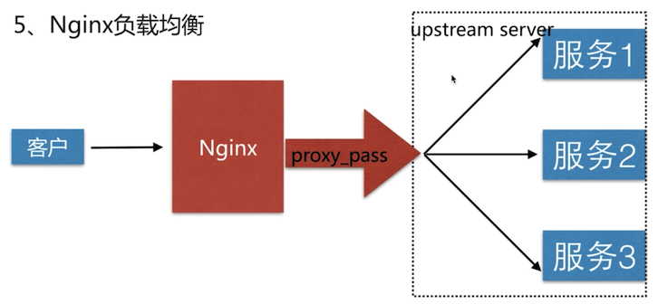
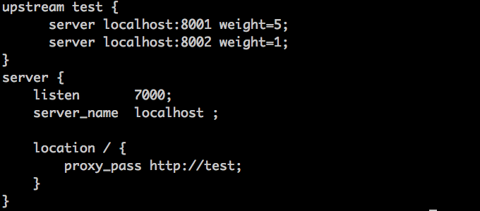
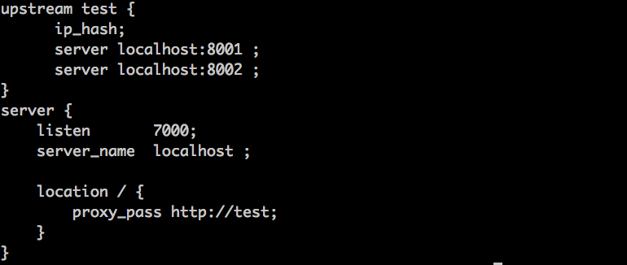

1、nginx负载均衡的分类

中间件负载均衡按照OSI模型分为四层负载均衡、七层负载均衡。

四层负载均衡指的是传输层，传输层是可以支持TCP/IP协议的，只需要进行TCP协议的包转发，就可以实现负载均衡。

优点是性能非常快，只需要底层进行处理，而不需要进行复杂的逻辑，只需要进行包的转发。 


七层负载均衡是在应用层，因此可以做一些应用层的处理，比如可以实现http协议的改写，头信息的改写，转发。。
 


nginx是典型的七层负载均衡的SLB。

2、nginx是负载均衡的原理。



`proxy_pass` 把所有客户端的请求转发到一组虚拟的服务池`upstream server`中，而`upstream server `可以定义服务单元，当请求到来时，proxy_pass 可以把请求分发到服务池中。

```
upstream 配置语法
Syntax: upstream name
Default:
Context : http;

```

3、nginx作为负载均衡例子


当访问`http://106.15.231.221:7000`时，请求会转发到端口是8001或者8002的服务。

其中8001配置如下，8002与8001类似。


配置的负载均衡是访问页面是随机的。

现在通过`iptables`屏蔽请求端口

```
iptables -I INPUT -p tcp --dport 8002 -j DROP
```

表示所有请求8002端口的请求都drop掉，现在再次请求7000端口时，转发到8002端口后，请求会卡顿，说明屏蔽8002服务起作用。

现在重新开启8002端口，请求正常。
```
iptables -I INPUT -p tcp --dport 8002 -j ACCEPT
```

```
iptables -F
```
表示设置的端口都关闭。


4、后端服务器在负载均衡调度中的状态


5、nginx的轮询策略。


* 基于加权轮序

下面为如果有6个请求访问，其中5个走8001，1个走8002。



* 基于IP-hash轮询策略

这样配置可以使得相同IP（根据属性$remote.addr）地址的请求进入同一个节点。




